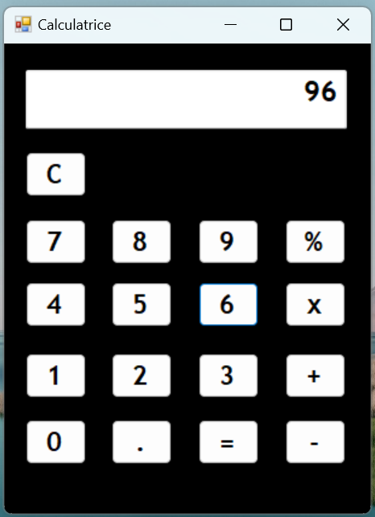

# TP Calculatrice – Visual Studio 2022 (Projet de 1ère année)
Ce projet consiste à programmer une calculatrice graphique en C# avec WinForms sous Visual Studio 2022. L'objectif est de concevoir une interface intuitive permettant de réaliser des calculs de base (addition, soustraction, multiplication, division).

## Fonctionnalités principales
* Affichage des chiffres et des opérations via un TextBox.
* Gestion des événements au clic des boutons numériques (0-9).
* Prise en charge des quatre opérations mathématiques.
* Affichage du résultat après validation.
* Bouton "C" pour effacer l'affichage et réinitialiser l'entrée.

  

## Auteur
- **Math-Baba** - [GitHub](https://github.com/Math-Baba)
